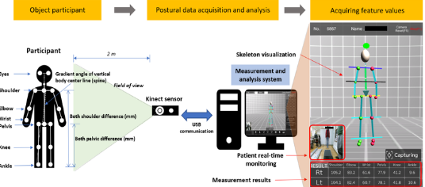
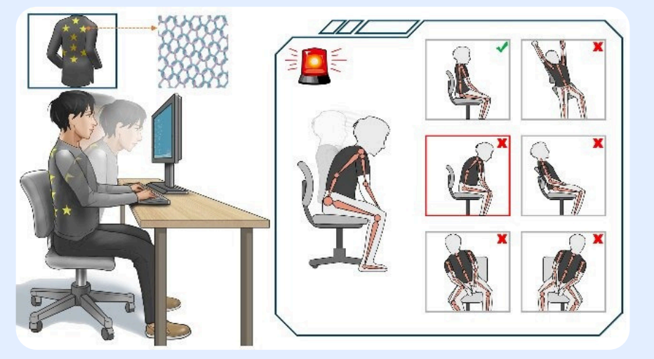
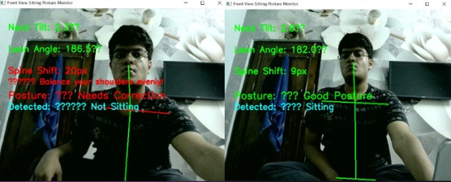
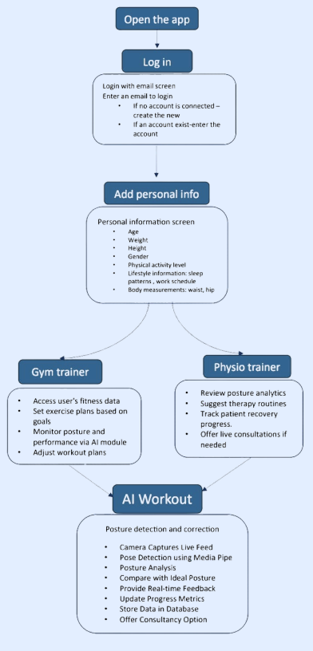

# 🧍 AI-Powered Physiotherapy & Medical Report Assistant


An intelligent healthcare assistant that combines AI, Computer Vision, OCR, NLP, and conversational AI to help users with posture analysis, physiotherapy guidance, and medical report understanding.

This project aims to make physiotherapy and health tracking more accessible without requiring constant doctor supervision.

---

# 📌 Project Overview

This system combines multiple AI technologies into one healthcare assistant platform.

The project includes:

- Real-time posture analysis
- Exercise & physiotherapy guidance
- Medical report summarization
- OCR-based text extraction
- AI-powered healthcare chatbot
- Health reminders & progress tracking

The system is designed for patients, fitness users, and physiotherapy assistance.

---

# 📸 Project Demo & Screenshots

## 🧍 AI Posture Detection


---

---

## 🧠 Solution Workflow



---

## 📱 Application Wireframe

---
# 🚀 Features

## 🔹 Posture Analysis
✅ Real-time posture detection  
✅ Body alignment tracking  
✅ Squat & sitting posture analysis  
✅ Exercise correction feedback  
✅ Rep and progress tracking  

---

## 🔹 Medical Report Understanding
✅ Upload PDF, JPG, PNG reports  
✅ OCR-based text extraction  
✅ AI-generated patient-friendly summaries  
✅ Medical jargon simplification  
✅ Report storage & tracking  

---

## 🔹 AI Chatbot
✅ Conversational healthcare assistant  
✅ GPT4All integration  
✅ Physiotherapy & exercise guidance  
✅ Report-based query answering  
✅ Daily reminders & suggestions  

---

## 🔹 Lifestyle & Health Tracking
✅ Exercise schedules  
✅ Water & sleep reminders  
✅ Fitness progress tracking  
✅ Follow-up reminders  

---

# 📂 Project Structure

```bash
POSTURE-ANALYSIS-SYSTEM/
│
├── CHATBOT.ipynb
├── IMAGE TO TEXT.ipynb
├── README.md
├── LICENSE
└── .gitignore
```

---

# 🧠 Technologies Used

## AI & Machine Learning
- Python
- TensorFlow
- Scikit-learn
- GPT4All

## Computer Vision
- OpenCV
- MediaPipe
- OpenPose

## OCR & NLP
- Tesseract OCR
- SBERT
- FAISS
- Transformer Models

## Frontend
- Flutter / React.js

---

# ⚙️ System Architecture

## Frontend
Minimal and accessible healthcare dashboard with:
- Exercise Tracking
- Camera Analysis
- Consultation
- Report Upload
- Schedule & Reminders

---

## Posture Analysis Model
- Skeleton extraction using MediaPipe/OpenPose
- Angle calculation for posture correction
- ML-based error detection
- Real-time feedback system

---

## OCR + NLP Pipeline
- OCR extracts text from medical reports
- NLP summarizes complex medical information
- Semantic search using SBERT + FAISS

---

## Chatbot Engine
- Retrieval-Augmented Generation (RAG)
- GPT4All fallback model
- Context-aware medical assistance

---

# 📈 Applications

- Physiotherapy Assistance
- Fitness & Exercise Monitoring
- Remote Health Monitoring
- Rehabilitation Support
- Medical Report Simplification
- AI Healthcare Assistance

---

# 🔒 Future Improvements

- Real-time webcam posture correction
- Mobile app integration
- Voice assistant support
- Multi-language medical report analysis
- Cloud-based patient dashboard
- AI-generated physiotherapy plans

---

# ⚙️ Installation

Clone the repository:

```bash
git clone https://github.com/yourusername/POSTURE-ANALYSIS-SYSTEM.git
```

Move into the project directory:

```bash
cd POSTURE-ANALYSIS-SYSTEM
```

Install dependencies:

```bash
pip install -r requirements.txt
```

Run Jupyter Notebook:

```bash
jupyter notebook
```

---

# 🤝 Contributing

Contributions are welcome.

Fork the repository and create a pull request.

---

# 📜 License

This project is licensed under the MIT License.

---

# 👨‍💻 Author

Developed as an AI-powered healthcare and physiotherapy assistance project using Computer Vision, NLP, and Machine Learning.

---

# ⭐ Support

If you found this project useful, give it a ⭐ on GitHub.
